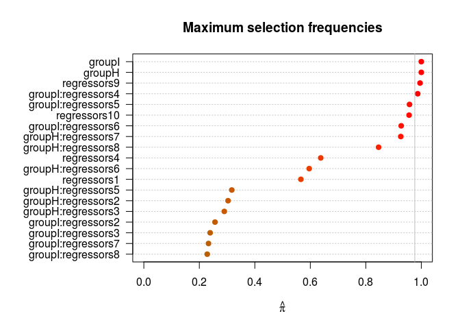
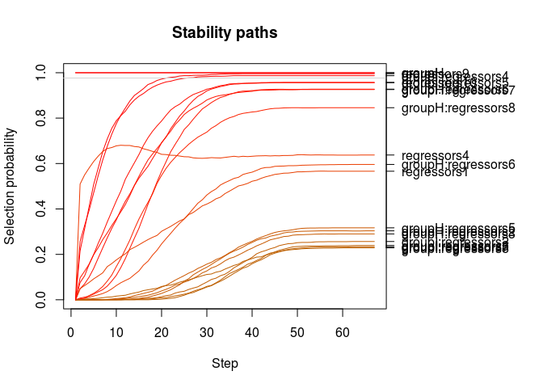

Install and load the package
----------------------------

``` r
devtools::install_github("Marie-PerrotDockes/Fus2mod")
```

    ## Skipping install of 'Fus2mod' from a github remote, the SHA1 (0c3738c9) has not changed since last install.
    ##   Use `force = TRUE` to force installation

``` r
require(Fus2mod)
```

    ## Loading required package: Fus2mod

    ## Loading required package: Matrix

    ## Loading required package: glmnet

    ## Loading required package: foreach

    ## Loaded glmnet 2.0-16

    ## Loading required package: parallel

    ## Loading required package: tidyverse

    ## ── Attaching packages ────────────────────────────────────────────────── tidyverse 1.2.1 ──

    ## ✔ ggplot2 2.2.1     ✔ purrr   0.2.4
    ## ✔ tibble  1.4.2     ✔ dplyr   0.7.4
    ## ✔ tidyr   0.8.0     ✔ stringr 1.3.0
    ## ✔ readr   1.1.1     ✔ forcats 0.3.0

    ## ── Conflicts ───────────────────────────────────────────────────── tidyverse_conflicts() ──
    ## ✖ purrr::accumulate() masks foreach::accumulate()
    ## ✖ tidyr::expand()     masks Matrix::expand()
    ## ✖ dplyr::filter()     masks stats::filter()
    ## ✖ dplyr::lag()        masks stats::lag()
    ## ✖ purrr::when()       masks foreach::when()

    ## Loading required package: stabs

Dataset Simulation
------------------

We start by generate a toy exemple, where we have two modalities H and I, 10 regressors and 30 individuals. For now we only have one response. We generate our dataset such that the 3 first regressor have no effect on the response , then the regressors 4, 5 and 6 have an effect on the response onl y on the sample that comes from the modality I and the regressors 7 and 8 have an effect on the response for the modality N but not for the modlity I.

``` r
n <- 40
p <- 10
K <- 2
q <- 1


# B <- Simul_B(p, q, s, f, k)
B <- c(0, 0,
       0, 0,
       0, 0,
       0, 0,
       0, 3,
       0, 2.5,
       0, 2,
       2.2, 0,
       1.8, 0,
       2, 2,
       2, 2
       )

group <- c(rep("H", n / 2), rep("I", n / 2))
K <- nlevels(as.factor(group))
regressor     <- matrix(rnorm(n * p), ncol = (length(B) / K - 1))

X             <- model.matrix(~group + group:regressor - 1)
y <- as.matrix(X %*% B + matrix(rnorm(n * q ), ncol = q))

y <- scale(y)
```

Model Selection
---------------

Here we foccus on the model *Y* = *X**B* + *E*, where *Y*, *B* and *E* are vector and *X* is a one-way ANCOVA design matrix. We have two objectifs : we want to find which collumns of *X* can explain the response *y* in the first hand. In the second hand we want to observe if the differents modalities influence the values of the coefficient of the regressor on the response, in other terms if the collumn group1:regressori will have the same coefficient than the collum group2:regressori. To do that we propose to apply a lasso criterion to the model : *Y* = *X*<sub>2</sub>*B* + *E* where *X*2 is the concatenation of *X* and the matrix of the regressor. To be abble to arrange the level of fusion we propose to put weight on the penalties a weight *b* if the coefficients is the coefficient of a couple regressor modalities and a weight *a* if the coefficients is the coefficients of a whole regressor. Like 2*p**b* + *p**a* must be equal to 3*p* + 2 fixing *a* will give us a value of *b*. Thus, the more *a* is small the more the model will encourage the coefficient of two different modalities for the same regressor to be the same. For more detail about this model we confer the reader to the file "2\_modalities.pdf".

We first propose a Cross-validation step. For different values of *a* we will apply a 5-fold CV on our data and keep the minimal error (cvm)and the degree of freedom (ddl) that match this minimal error. We will do that *n**r**e**p* = 10 times for each value of *a* the mean on this 10 replicats are display bellow.

``` r
 CV <- cv.fl2(response = y, regressors = regressor, group = group, mina = 0.1, nfold = 5, nrep= 10,
                   nb.cores = 3, plot = TRUE)
```


By watching this plot we propose to take the *a* that minimise the degree of freedom because it is the lower (or really close to ) the lower error of prediction.

``` r
ddl <- CV[CV$Criterion =="ddl", ]
a <- ddl[which.min(ddl$mean), "a"]
a
```

    ## # A tibble: 1 x 1
    ## # Groups:   a [1]
    ##       a
    ##   <dbl>
    ## 1  1.28

If we want we can add a stability selection step to keep the more stable variable. In order to avoid that sometimes the model select as non null value the coefficient of the whole regressor and sometimes it keep it only for one modality we perform the fusion before the stability selection and then apply the stability selection step.

``` r
stab <- stab.fl2_fixa(response = y, regressor, group, a,
                   lambda = NULL,  nrep= 100,
                   nb.cores = 3, plot = TRUE)
stab
```

    ##  Stability Selection with unimodality assumption
    ## 
    ## Selected variables:
    ## groupI:regressors4       regressors10 
    ##                 10                 32 
    ## 
    ## Selection probabilities:
    ##  groupH:regressors5  groupI:regressors8  groupH:regressors6 
    ##               0.080               0.095               0.100 
    ##  groupH:regressors2  groupI:regressors7              groupI 
    ##               0.105               0.150               0.165 
    ## groupH:regressors10  groupH:regressors4  groupH:regressors3 
    ##               0.175               0.190               0.195 
    ##  groupH:regressors1  groupH:regressors9  groupI:regressors2 
    ##               0.225               0.225               0.260 
    ##  groupI:regressors3              groupH  groupI:regressors9 
    ##               0.285               0.305               0.315 
    ##         regressors2         regressors3 groupI:regressors10 
    ##               0.315               0.320               0.360 
    ##         regressors7         regressors1         regressors8 
    ##               0.455               0.470               0.480 
    ##         regressors6         regressors4         regressors5 
    ##               0.565               0.580               0.590 
    ##  groupI:regressors1  groupI:regressors5  groupI:regressors6 
    ##               0.620               0.620               0.745 
    ##  groupH:regressors7  groupH:regressors8         regressors9 
    ##               0.750               0.770               0.965 
    ##  groupI:regressors4        regressors10 
    ##               0.980               0.995 
    ## 
    ## ---
    ## Cutoff: 0.97; q: 15; PFER (*):  0.975 
    ##    (*) or expected number of low selection probability variables
    ## PFER (specified upper bound):  1 
    ## PFER corresponds to signif. level 0.0305 (without multiplicity adjustment)

``` r
par(mf.row=c(1,2))
```

    ## Warning in par(mf.row = c(1, 2)): "mf.row" n'est pas un paramètre graphique

``` r
plot(stab, type="maxsel", main="Maximum selection frequencies")
```



``` r
plot(stab, type="path", main="Stability paths")
```



``` r
sel <-names(stabsel(stab, cutoff=0.8)$selected)
sel 
```

    ## [1] "groupI:regressors4" "regressors9"        "regressors10"

``` r
names(B) <- colnames(X)

B_long <- c(0, 0,
       0, 0,
       0, 0,
       0, 0,
       0, 1.4,
       0, 1.5,
       0, 2,
       1.2, 0,
       1.8, 0,
       0, 0,
       0, 0, 
       rep(0 ,8),1,1
       )
colnames(regressor) <- paste0('regressors', 1:p)
names(B_long) <- c(colnames(X), colnames(regressor))
```

If we take a threshold of 0.8, we have a True Positive Rate equal to 0.29 and a False Positive Rate equal to 0.
